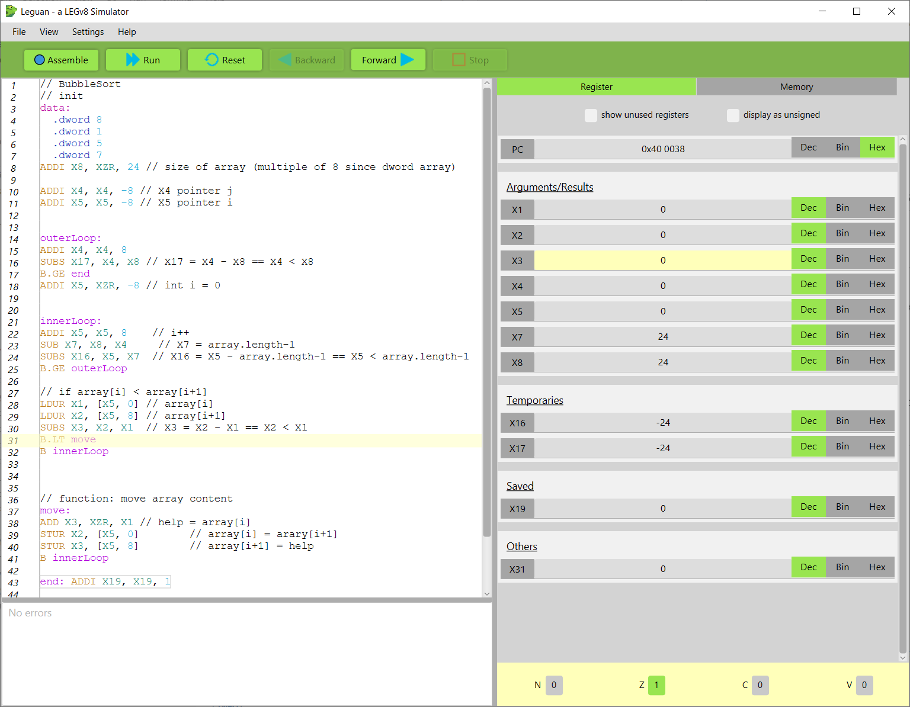

# Leguan - A LEGv8 Instruction Set Simulator 

This project is a Java-based simulator for the **LEGv8 instruction set**, based on Computer Organization and Design: The Hardware/Software Interface (ARM Edition) by **D. Patterson and J. Hennessy**.

## Features
* Syntax Highlighting
* Run code step-wise or all at once
* Supports entire **Core Instruction Set** [see LEGv8 Greencard](https://www.usna.edu/Users/cs/lmcdowel/courses/ic220/S20/resources/ARM-v8-Quick-Reference-Guide.pdf)
* Show registers in **different numeral systems** (decimal, binary, hexadecimal)
* Useable **data segment** (byte, halfword, word, dword, ASCII)
* Display **memory as Bytes or DWords**
* Interactive **instruction pipeline** (statistics and different options for handling data and control hazards)
* Toggleable **Condition Flags** (switch each flag on/off)

This simulator aims to provide an accessible way to learn and experiment with **LEGv8** assembly programming.

## Installation

* Requires **Java11+ (JDK)** [Download via OpenLogic](https://www.openlogic.com/openjdk-downloads) or [via Adoptium](https://adoptium.net/de/temurin/releases/?version=11)

### Windows

1. Run the downloaded .msi and follow the installation wizard
2. Simply run the .exe with double click

### Linux/MAC

1. Open a console/ terminal
2. Enter the following command to make the app executable `chmod a+x Leguan-XXX.sh` (replace with filename)
3. Run with `sh Leguan-XXX.sh` (replace with filename)

## Developer Setup

* Install **Java11+**
* Install **maven** 
* Run: `mvn javafx:run -f .\pom.xml`
