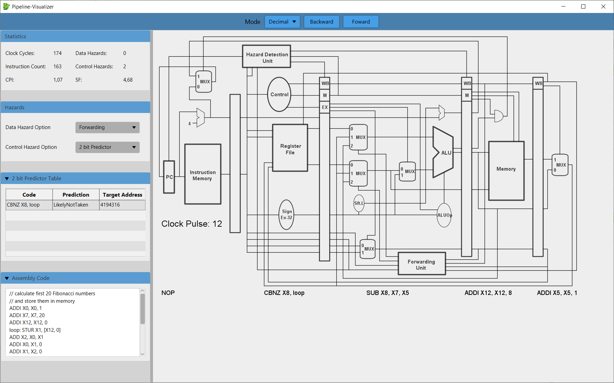

# Pipelining
This section describes the Pipelining Visualiser extension that allows the simulation of LEGv8 code in a 5-stage-Pipeline as described in Computer Organization and Design: The Hardware/Software Interface (ARM Edition) by **D. Patterson and J. Hennessy**.

## How to Use
1. In the menu under the tab *View* -> *Show Pipeline-Visualizer*
2. To Load/ Compile the code Click on the *Assemble* Button in the main simulator (Leguan)

## Features
* Use Forward and Backward to execute the code per clock cycle
* Click on the **register file or memory** block in the circuit diagram to show its content
* **Hover over a wire** to see its value
* Change the mode to display wire values in **different numeral systems**
* Change handling of **data and control hazards**

## Note
* Changing the Options for control/ data hazards resets the simulator - effectivly skipping back to the first instruction of your program
* Instructions **may be handled differently** in the Pipeline-Visualizer than in Leguan